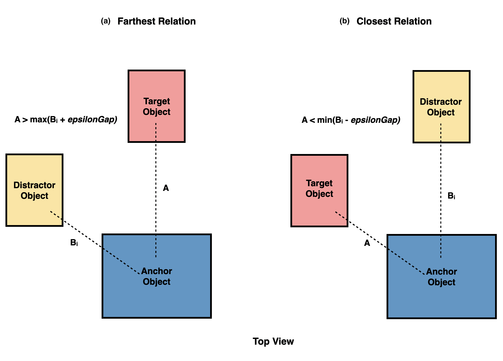
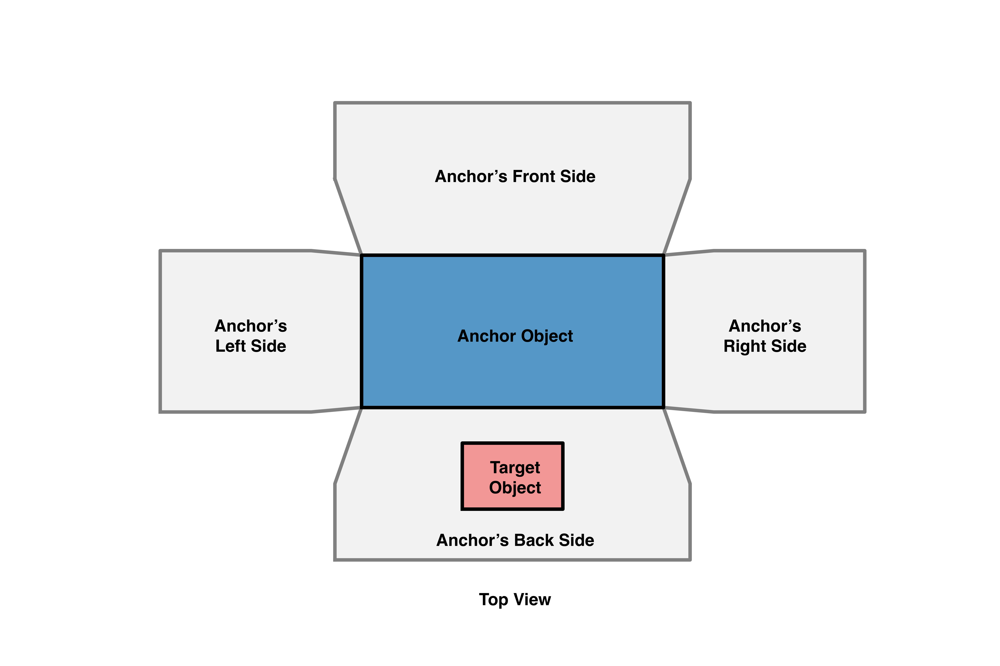
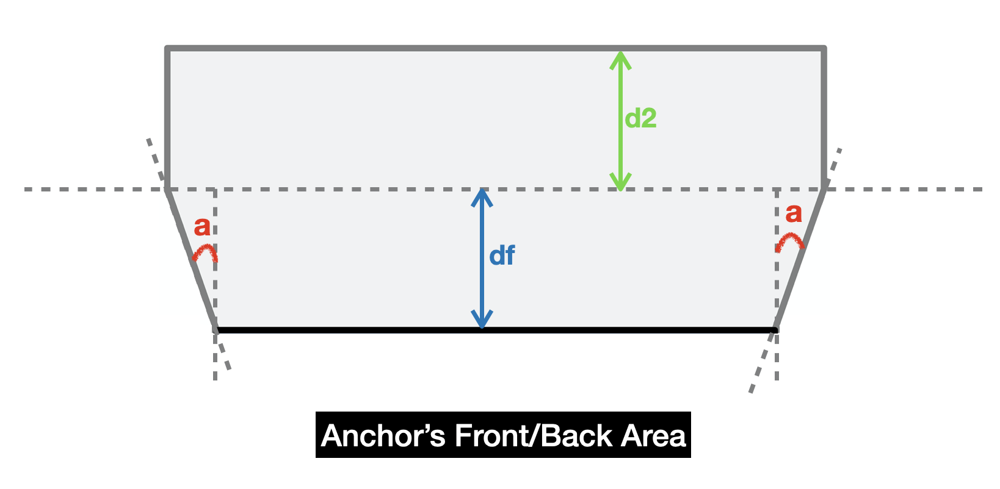
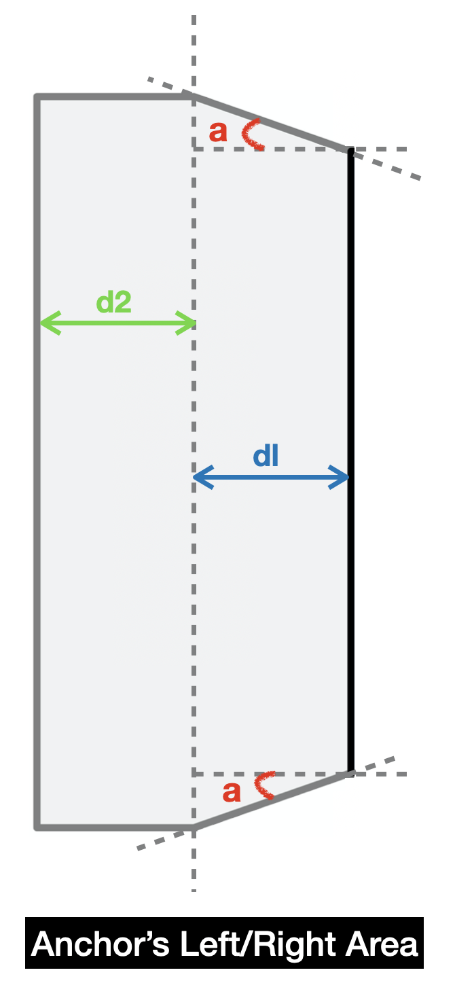
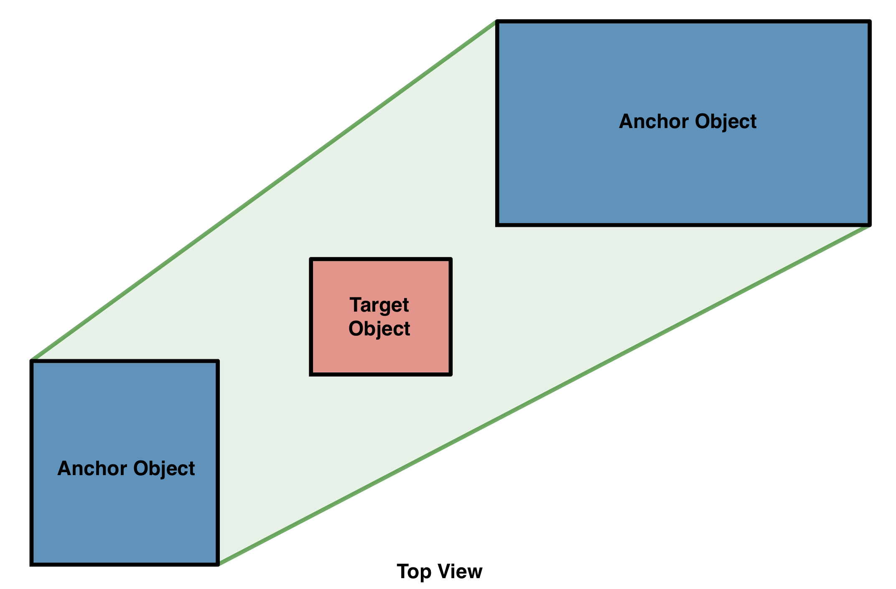

# Sr3D Generation

In this file, we will discuss the algorithms for creating Sr3D spatial references and the hyper-parameters used.

# A. Horizontal Proximity References Gerenation

# B. Allocentric References Generation

# C. Between References Generation

# D. Vertical References Generation

